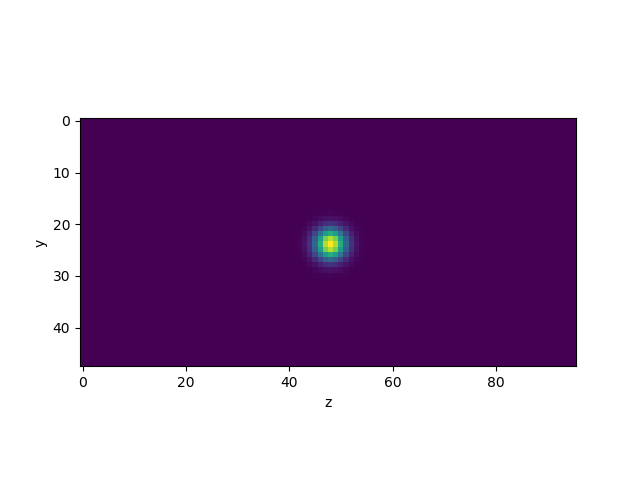
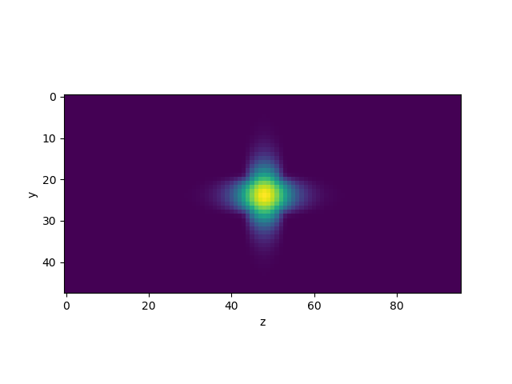
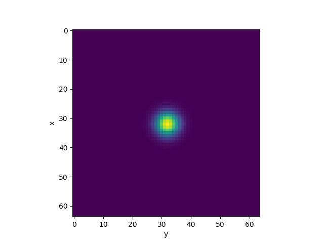
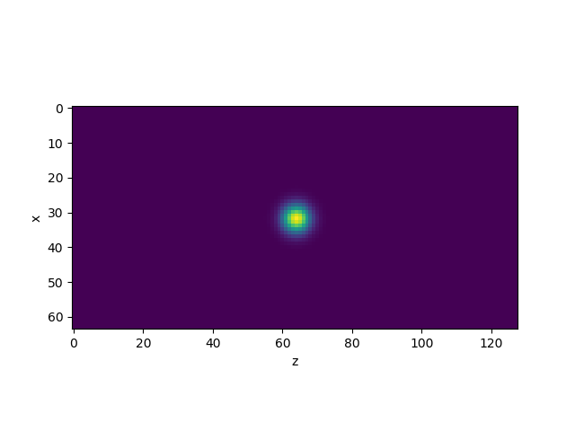
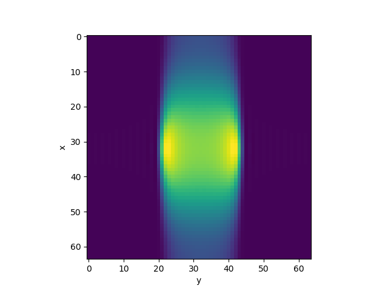
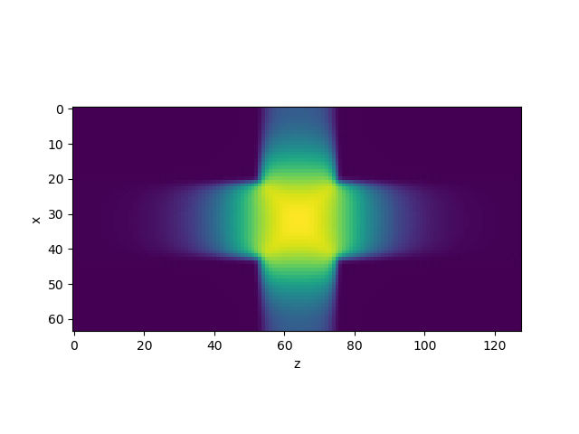
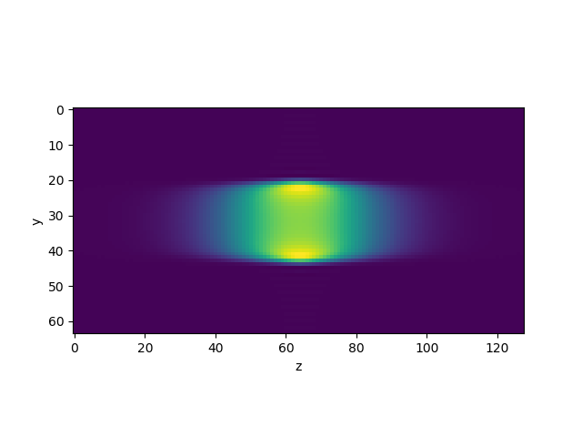
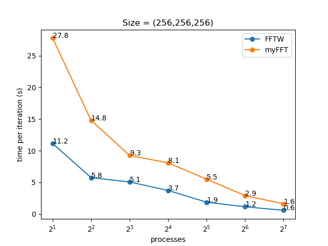
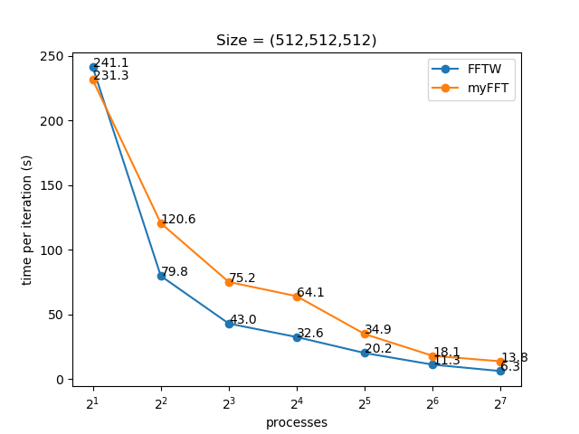
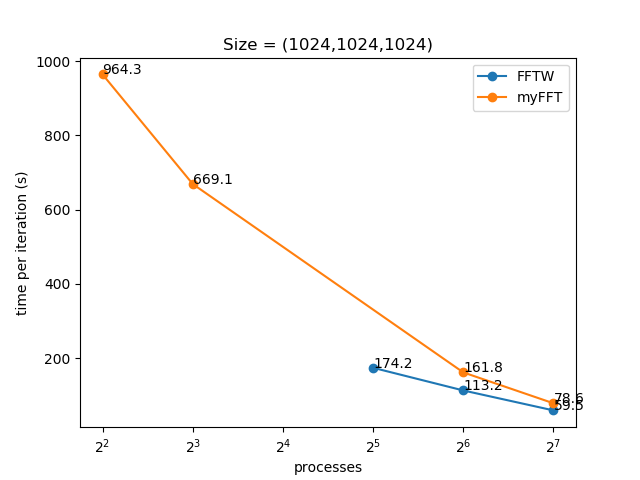

## Statement of the Problem

In this directory, we are developing a solution to the proposed problem in class.
The aims of this project are:

- implement a 1-dimensional Fast Fourier Transform,
- implement a parallel 3-dimensional Fast Fourier Transform that uses the 1-dimensional
algorithm,
- solve the diffusion equation in 3-dimensions using Fast Fourier Transform to compute
derivatives (gradients and divergences),
- compare the performance of this FFT with the one provided in the library FFTW.

## Achievements

- We have implemented three 1-dimensional Fourier transform functions:
one using brute force `FFT_BruteForce`, and two based on the 
FFT Divide and Conquer approach,
one recursive `FFT_DivideAndConquer` and the other one which 
is not recursive and uses less memory allocation `FFT_Iterative`.

- The three aforementioned functions are templated on any class 
that implements the concept of an algebraic ring. 
This allows to use this functions either for complex numbers 
at any precision eg. `complex<double>` or `complex<long double>`,
or modular integers (Number Theoretical Fourier Transform: 
http://mathworld.wolfram.com/NumberTheoreticTransform.html)
or even non-commutative objects like matrices eg. `complex<matrix>`.

- Unit tests to check the validity of the the FT implementations are provided.

- Added a wrapper for FFTW3. In the unit test suite the most 
extreme case asks to compute one forward and one backward Fourier transform
on a complex array of *N=10^6* elements.
This task is performed in 3.23 seconds using the `FFT_Iterative`,
compared to 2.58 seconds employed by `FFTW3` (the FFTW wrapper).

- We have implemented a parallel version of the diffusion problem,
using a distributed memory approach. To that end, there
is a multipurpose templated class called `parallel_buff_3D`
that contains the local domain and handles the interprocess communication
that regards its own data.

- Using the fftw library we manage to solve the diffusion equation for
a small test domain of size 48x48x96. Here the concentration at
time step 0 and time step 1000:

||
|:--:|
|*Concentration at t=0, y-z slice.*|

||
|:--:|
|*Concentration at t=1000, y-z slice, using FFTW3.*|

- We have implemented a parallel 3-dimensional Fast Fourier Transform
as a public function of the `parallel_buff_3D` class.
It has been tested with domains with different sizes per dimension.
It is guaranteed to work if the number of mpi processes
divides the size of every dimension of the domain
and they're all powers of two. Here's 
an example of the 3-dimensional diffusion problem 
for a box of size 64x64x128 at time step 0 and 10000
computed with our 3D FFT:

||
|:--:|
|*Concentration at t=0, using my 3D FFT.*|

||
|:--:|
|*Concentration at t=0, using my 3D FFT.*|

||
|:--:|
|*Concentration at t=0, using my 3D FFT.*|

||
|:--:|
|*Concentration at t=10000, using my 3D FFT.*|

||
|:--:|
|*Concentration at t=10000, using my 3D FFT.*|

||
|:--:|
|*Concentration at t=10000, using my 3D FFT.*|

- Here we present the results of the benchmarks,
for different box sizes: 256^3, 512^3 and 1024^3,
and for different number of processes:








## Instructions

### Compiling

We provide a `meson.build` file for automatic dependency handling,
so make sure you have installed the meson builder,
also a pkgconfig file to link the fftw3-mpi library can be found within
this directory. Thus the compilations steps on Ulysses are:

- Load all necessary environment variables: `source env.sh`.
This operation loads a python environment with meson,  
the openmpi and fftw version that have tested with our sources,
and finally it makes our pkgconfig directory visible.
- then autoconfigure and compile with meson: `meson build && cd build && ninja`.

### Running

Withing the `build` directory created in the
compilation step you can run tests `ninja test` to check the integrity of the library.

All benchmarks presented here, can be reproduced by executing the
bash script `run.sh`.
But for a particular execution of the program
notice there are two executables: `diffusion.x` compiled with my own implementation 
of the 3D FFT and `diffution_fftw.x` compiled with FFTW3.
To each execution, one parameter file must be provided containing the follwing
variables: 
- Nx, Ny and Nz, the size of the domain box for every dimension.
- dT, the time step.
- Nsteps, the number of time steps to be executed.
- tlimit, the walltime limit in minutes.
- output, either 'yes' or 'no', to indicate if a snapshot of the concentration
have to be saved at the begining and the end of the simulation.

Here's an example of a parameter file:
```
$ cat 128.par 
 Nx = 64
 Ny = 64
 Nz=   128
 dT=  0.001
 Nsteps = 10000
 tlimit = 60
 output = yes
```

### Report of the bechmarks

Each run of the simulation will save a json file reporting
the simulation parameters and the time consumed at each time step.
To gather all of that data we have created a python script `report.py`
that reads all json files within the `data` directory and reports the results.

For instance, to display wich boxes sizes have been simulated you type:
```
$ ./report.py list
Domain sizes: {(64, 64, 128), (256, 256, 256), (512, 512, 512), (1024, 1024, 1024)}
```

To display the result of the benchmark for a box size of (1024,1024,1024) you will execute:
```
$ ./report.py plot-bench -x 1024 -y 1024 -z 1024
```

To display the concentration slices from a snapshot, use the command `./report.sh plot-data <filename>`.
eg.:
```
$ ./report.py plot-data data/concentration_final.dat
```


